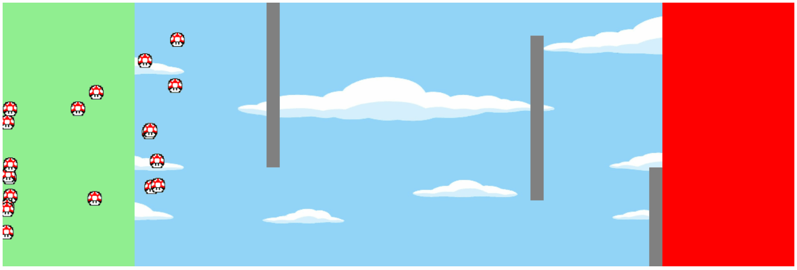

## obstacle-course-genetic-algorithm

### Aim
Aim of the project was to create a simulation where small mushrooms learn how to overcome obstacle course using genetic algorithm.

### Rules
Simulation consits of a fixed number of games. In each game whole population of mushrooms tries to reach finish area. At the beginning each mushroom is placed in start area (green box). On it's way to finish area (red box), it must not touch any obstacles or edges. Single game ends when all mushrooms are dead. They may die either in glory, reaching the goal or as loosers, smashing on obstacles. 

### Algorithm
Each mushroom (individual) has randomly initialized chromosome which is just an array of moves. Move can can be made in any direction (any angle). When single game ends, whole population is used to create new one. Best individuals are those, who were closest to finish area at the on of a game. Best individual remains unchanged and rest part of population is created using genetic methods such as selection, crossover and mutation.

### Preview

### Try it by yourself
You can run this easily in your own web browser. Just clone repo and put it on some server. I used simple http-server (https://www.npmjs.com/package/http-server) and Google Chrome v. ~75 (it is important because of usage es6 javascript without any converter).